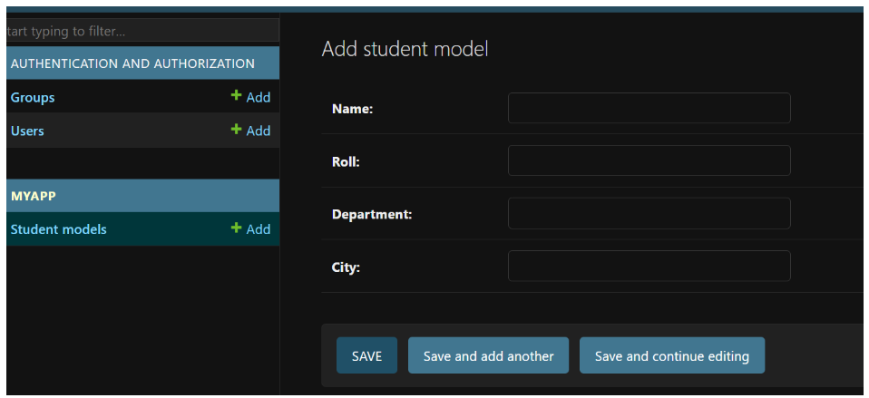

# 5th Class

### Topics:
+ Create App in Django Project
+ Create & Register Models
+ Add Entity & Attributes

## <b>Django App & Models:</b>
 Django model is a Python class that represents a database table. Django models are used to define the structure of the data in our application and how it will be stored in the database.

Each attribute of a Django model class represents a database field, and the type of the attribute determines the type of the corresponding database column. Django provides built-in field types such as IntegerField, CharField, DateTimeField, etc., and you can also create custom field types if needed.

### Process of createing app and models:
---

+ First Virtual Environment
    ```cmd
    python-m venv environmentName
    ```
+ Activate Virtual Environment:
    ```cmd
    .\environmentName\Scripts\activate
    ```
+ Create django project:
    ```python
    django-admin startproject projectName
    ```
+ Before work with django models we need to create super user. If already create then not need to create super user.
+ Under the Django Project folder create App Folder using Django command.
    ```cmd
    django-admin startapp appName
    ```
+ Define the appName inside the  `INSTALL_APPS = []` list into the `settings.py` script.
    ```python
    INSTALLED_APPS = [
        'django.contrib.admin',
        ...
        ...
        'django.contrib.staticfiles',
        'appName',
    ]
    ```
    We must need to define appName after create the appDirectory. Otherwise, project not work properly.
+ Create a model class under `models.py` script.<br>
    Syntax:
    ```python
    class modelName(models.Model):
        entityName = models.fieldTypes(length)
    ```
    Example:
    ```python
    class studentModel(models.Model):
        studentid= models.CharField(max_length=10)
        studentname= models.CharField(max_length=100)
        department= models.CharField(max_length=100)        
    ```
    Remember, we cannot use `id` as the name of the entity. Because when we create a model then it automatic create an `id` as an entity.
+ Then register the model into `admin.py` script. At first import the model then register.
    ```python
    from appName.models import modelName

    admin.site.register(modelName)
    ```
    Example:
    ```python
    from myApp.models import studentModel

    admin.site.register(studentModel)
    ```
+ Everytime, after creating model then we need to migrate our database. Otherwise error occured name `(no such table)`:
    ```cmd
    py manage.py makemigrations
    ```
    ```cmd
    py manage.py migrate
    ```
+ Then runserver and login the admin panel.
    ```cmd
    py manage.py runserver
    ```
+ Under the app folder we can add the attribute:
    
    
+ To display the attribute in the standard way in the admin panel create a self-function under the modelClass:
    ```python
    def __str__(self):
        return self.studentname +"-"+ self.department
    ```
+ If we want to view the data from DB SQLite Browser then open it and open the the database file from the project folder file name: `db.sqlite3`
+ From the table option in DB SQLite Browser  select tableName.