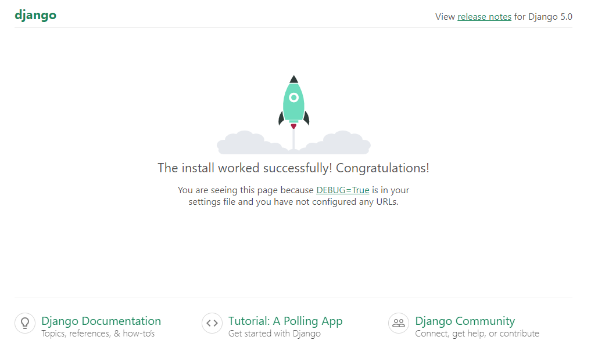

# First Class

<details>
<summary><b>Start with Django</b></summary>


Django is a high-level Python web framework. We can do everything using CMD.

+ First Install Python. Because Django is a pthon framework. Here we do everything using python.
+ Create a Root Folder. In this folder we do django related every work.
+ Open Folder and click the folder path. To open command prompt type 'cmd' and press entry.
+ We need to Create a Virtual Environment. Virtual Environent allows for isolating project dependencies, ensuring version control, resolving conflicts, maintaining a clean development environment.
  ```cmd
  python -m venv foldername
  ```
+ After create the virtual environment then activate the virtual environment.
  ```cmd
  .\foldername\Scripts\activate
  ```
+ After activate, Install Django.
  ```cmd
  pip install django
  ```
+ Create a Django project  under the root folder.
  ```cmd
  django-admin startporject projectname
  ```
+ After create project install some django files and folder. Then entry the project folder.
  ```cmd
  cd projectname
  ```
+ Run Django project server
  ```cmd
  python manage.py runserver
  ```
After run the server create a local server url. Copy url and paste on any browser. After paste if open this then server run properly.



</details>